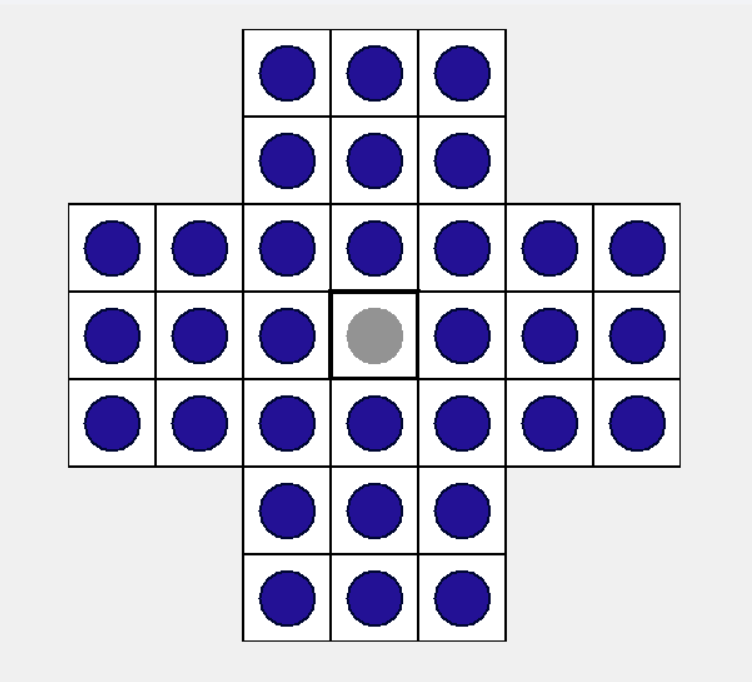
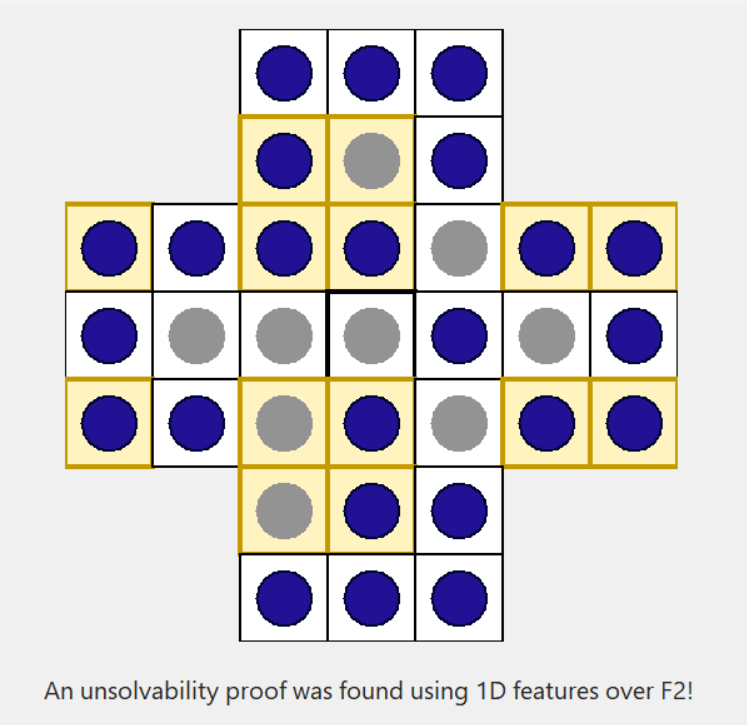
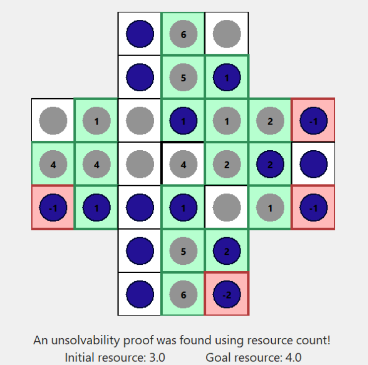

# The (Partial) Peg Solitaire Unsolvability Checker 
## About
The (Partial) Peg Solitaire Unsolvability Checker allows users to test an initial Peg Solitaire configuration for unsolvability. We use a classic English board where the goal is to end up with one peg in the center position (cell (3, 3)).    
The project itself tries finding an unsolvability proof using two different methods:
1. **Separating function over one-dimensional features over F2.**  
   This is a parity-based method. The checker searches for a weight function over cells such that every move preserves the parity of the selected cells (i.e. cells with a weight of 1), while the initial and goal configurations have different parity.  
   This is based on the separating functions framework by Christen et al. in *Detecting Unsolvability Based on Separating Functions* (2022). 

2. **Resource-count method.**  
   This method is based on Beasley’s resource-count arguments for Peg Solitaire. Each board cell is assigned a weight. The resource of a state is the sum of the weights of all occupied cells. The checker searches for weights such that every move can only preserve or decrease the resource value. If we find weights such that the goal state has a higher value than the initial state it is unsolvable. This is a monovariant argument as the resource value can only decrease or stay the same.
This is based on Chapter 5 of *The Ins and Outs of Peg Solitaire* (1985) by J. D. Beasley.

Our approach might not recognize all unsolvable instances. If we don't find a proof it does **not** follow that the puzzle is actually solvable.

## How to Start 
The project is written in Python. It was tested with Python 3.10.11.  
The needed dependencies are defined in `dependencies.txt`. They can be installed with:
```bash
pip install -r dependencies.txt
```
The project uses `tkinter` from Python's standard library. However, for some Linux systems (e.g. Ubuntu) it may not be automatically included and needs to be installed separately.  

The project can be started with:
```bash
python main.py
````
or: 
```bash
python3 main.py
```

## How to Use
We always start in the classic initial configuration where the center peg is missing, i.e. position (3, 3). The goal is to end up with a single peg in the center hole (3, 3).  


### Setup  
By clicking on a peg we remove it. Clicking on a hole adds a peg. With the `Clear Board` button we can remove all pegs. With `Reset Board` we go back to the classic initial configuration.

### Finding a Proof
If we are happy with our initial configuration we can press `Check`, this searches for an unsolvability proof. There are three possible outcomes:  
- **We find a proof using 1D features over F2**.  
The highlighted cells are the ones the weight function (of the potential function representing the separating function) assigns a value of 1. Every move will preserve the parity of pegs in the highlighted cells.  


- **We find a proof using the resource-count based approach**.  
The cells highlighted in green are the ones that get assigned a positive weight, the red cells get assigned a negative weight. Cells without a highlight have a weight of 0. The weights are also specified in each cell. If the total weight of cells occupied by pegs in the intial configuration (*initial resource*) is smaller than the weight of the center cell (*goal resource*), the problem is unsolvable.  


- **We cannot find a proof**.    
In this case we enter the *TRY IT* mode where the user can play Peg Solitaire starting from the given position. While playing the `Check` button can still be used. *TRY IT* mode can be deactivated by pressing the `Stop Trying` button. This returns us to the *SETUP* mode.
